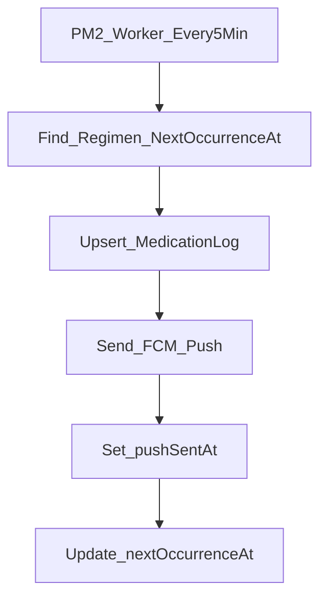

# Plan: Cron queue + FCM push

## Goal

Create a backend worker (PM2) that:

- Finds regimens that are due soon (using `nextOccurrenceAt`)
- Creates `MedicationLog` (as the queue item)
- Sends FCM push (Firebase Admin SDK)
- Updates `UserMedicineRegimen.nextOccurrenceAt` to the next time

## Assumptions (your part)

- You will add a device token table (example: `UserDevice`) and an API to register/update the FCM token.
- Worker can find tokens by `userId`.

## Data model changes (Prisma)

- Update `MedicationLog` in [`prisma/schema.prisma`](/root/Project/final-project-backend/prisma/schema.prisma):
  - Add `pushSentAt DateTime?`
  - Add `supabaseSentAt DateTime?` (optional, but useful if you still want to sync)
  - Add unique key to stop duplicates: `@@unique([profileId, mediRegimenId, scheduleTime])`

## Worker flow (every 5 min)

1. **Select due regimens**

   - `nextOccurrenceAt != null` and `nextOccurrenceAt <= now + 5min`
   - `endDate is null OR endDate >= now`
   - include `times` and `medicineList.profile.userId` (to get `userId` + `profileId`)

2. **Create queue item**

   - `upsert` a `MedicationLog` with `(profileId, mediRegimenId, scheduleTime)`
   - this makes the job “saved” in DB

3. **Send push**

   - load user’s FCM tokens from your `UserDevice` table
   - send push with Firebase Admin (`firebase-admin`)
   - if success, set `MedicationLog.pushSentAt = now`

4. **Move the regimen forward**

   - reuse the existing `calculateNextOccurrence` logic from [`server/medicineRegimen/medicineRegimen.service.ts`](/root/Project/final-project-backend/server/medicineRegimen/medicineRegimen.service.ts)
   - make it reusable by moving it to a shared file (example: `server/medicineRegimen/nextOccurrence.ts`) and exporting it
   - update `UserMedicineRegimen.nextOccurrenceAt` using `now = oldNextOccurrenceAt` (so it always moves forward)

## Files to add/change

- [`prisma/schema.prisma`](/root/Project/final-project-backend/prisma/schema.prisma) (MedicationLog fields + unique)
- Add migration SQL under [`prisma/migrations/`](/root/Project/final-project-backend/prisma/migrations/)
- New worker script: `server/workers/medicationCron.worker.ts`
- New push sender: `server/push/fcm.ts` (Firebase Admin init + send)
- Refactor next occurrence helper out of `medicineRegimen.service.ts` to a shared exported module
- Update PM2 config [`ecosystem.config.cjs`](/root/Project/final-project-backend/ecosystem.config.cjs) to run the worker

## Env vars

- `FIREBASE_SERVICE_ACCOUNT_JSON` (the full JSON string)
- Or split vars (projectId/clientEmail/privateKey) if you prefer

## Safety / no duplicate sends

- DB unique key prevents duplicate `MedicationLog`
- Worker checks `pushSentAt is null` before sending
- Optional: add a simple “lock” update to avoid two workers sending the same log at the same time

## Simple mermaid flow

## What I will deliver when you accept

- Full code changes + migration + worker registered in PM2
- A small README note: how to set `FIREBASE_SERVICE_ACCOUNT_JSON` and how to test the worker locally