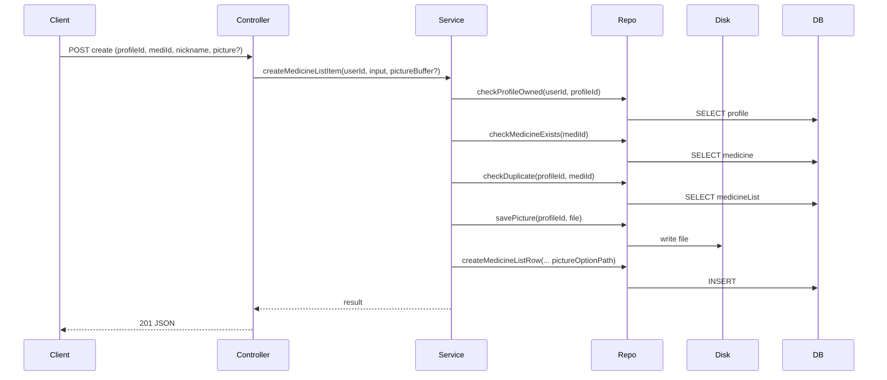

# Mobile MedicineList APIs (create/list/update/delete)

## Goal

Create mobile APIs to manage `MedicineList` rows (match `profileId` + `mediId`, set nickname, optional picture upload). The uploaded picture is saved on disk at `public/uploads/medicine_database/medicine_option/{profileId}/...` and the DB field `pictureOption` stores the **full URL path** (example: `/uploads/medicine_database/medicine_option/12/1700000000.png`).You chose:

- Mobile endpoints (`/api/mobile/v1/...`)
- Picture is uploaded as a file (`multipart/form-data`)
- On duplicate (`profileId` + `mediId`) return **409**

## Endpoints (controllers)

Create 4 route handlers (thin controllers):

- `POST /api/mobile/v1/medicine-list/create`
- `GET /api/mobile/v1/medicine-list/list?profileId=...`
- `PATCH /api/mobile/v1/medicine-list/update`
- `DELETE /api/mobile/v1/medicine-list/delete`

Controllers will follow the same style as mobile profile routes:

- Use `withAuth` from [`lib/apiHelpers.ts`](/root/Project/final-project-backend/lib/apiHelpers.ts)
- Accept `application/json` (easy test) and `multipart/form-data` (real file upload)
- Parse `File` → `Buffer` and pass `{ buffer, originalFilename }` to the service

## Service + repository (business logic + DB)

Add a new feature folder (Controller–Service–Repository):

- [`server/medicineList/medicineList.service.ts`](/root/Project/final-project-backend/server/medicineList/medicineList.service.ts)
- [`server/medicineList/medicineList.repository.ts`](/root/Project/final-project-backend/server/medicineList/medicineList.repository.ts)

Service responsibilities:

- Check the `profileId` belongs to the current user (`userId` from `withAuth`)
- Check `mediId` exists and is not deleted
- Enforce duplicate rule: if the same (`profileId`,`mediId`) already exists → throw `ServiceError(409, { error: ... })`
- Validate uploaded image (only `jpg/jpeg/png/webp`, max 5MB)
- Call repository to save file + create/update/delete row
- On update/delete: delete old picture file best‑effort (do not fail API if file missing)

Repository responsibilities:

- Prisma queries on `MedicineList` (and joins to `UserProfile` / `MedicineDatabase`)
- File IO helpers:
- Save uploaded file to `public/uploads/medicine_database/medicine_option/{profileId}/...`
- Return stored URL path `/uploads/medicine_database/medicine_option/{profileId}/{fileName}`
- Safe delete helper that only deletes inside that folder (prevents path traversal)

## Data flow (simple)

## OpenAPI docs update

Update [`public/openapi.json`](/root/Project/final-project-backend/public/openapi.json):

- Add tag `Mobile - MedicineList`
- Add it to `x-tagGroups` → Mobile
- Add 4 paths with correct requestBody:
- `create/update/delete`: support `multipart/form-data` with `picture` as `string` + `format: binary`
- `list`: query param `profileId`
- Mark all 4 as protected: `"security": [{ "bearerAuth": [] }]`

## Notes / defaults (what I will implement)

- **Picture optional**: if no picture is sent, `pictureOption` stays `null`.
- **Update**: can update nickname, picture, or both. If a new picture is uploaded, old picture file is deleted best‑effort.
- **Delete**: deletes the DB row and deletes its picture file best‑effort.