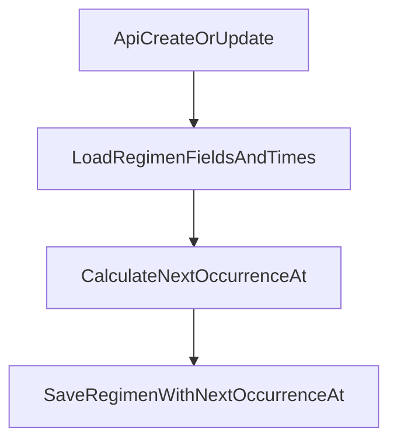

# Restore NEXT_OCCURRENCE_AT and calculate it in API

## Goal

- Keep **`NEXT_OCCURRENCE_AT`** in `USER_MEDICINE_REGIMEN` so you can send the next notification time.
- Add API logic to **calculate** `NEXT_OCCURRENCE_AT` when you **create** or **update** a regimen.
- **No bulk update/backfill** in this plan (you said you will write a script for that).

## What we will change

- **Database**: add column `NEXT_OCCURRENCE_AT` back (nullable).
- **Prisma**: add field `nextOccurrenceAt` back to `UserMedicineRegimen`.
- **API logic**: calculate `nextOccurrenceAt` in:
  - `POST /api/mobile/v1/medicine-regimen/create`
  - `PATCH /api/mobile/v1/medicine-regimen/update`

## Key decisions (from your answers)

- **Timezone**: use **server timezone** (normal JS `Date` behavior on the backend).
- **When to set**: set on **create**, and also on **update** when schedule/startDate/endDate changes.

## NextOccurrenceAt rules (simple and clear)

We will compute the **nearest future dose time**:

- Use `now = new Date()`.
- Do not return a time **before** `startDate`.
- If `endDate` exists and the next time is **after** `endDate`, then set `nextOccurrenceAt = null`.
- Use regimen `times` (HH:MM) as the times in a day.

Schedule types:
- **DAILY**: every day
- **WEEKLY**: only days in `daysOfWeek` (0=Sunday … 6=Saturday)
- **INTERVAL**: every `intervalDays` days from `startDate`
- **CYCLE**: `cycleOnDays` on, then `cycleBreakDays` break, repeat (anchor = `startDate`)

## Data flow (high level)

## Files we will edit

- Prisma:
  - [`/root/Project/final-project-backend/prisma/schema.prisma`](/root/Project/final-project-backend/prisma/schema.prisma)
  - Create a new migration under [`/root/Project/final-project-backend/prisma/migrations/`](/root/Project/final-project-backend/prisma/migrations/)
- Backend logic:
  - [`/root/Project/final-project-backend/server/medicineRegimen/medicineRegimen.service.ts`](/root/Project/final-project-backend/server/medicineRegimen/medicineRegimen.service.ts)
  - [`/root/Project/final-project-backend/server/medicineRegimen/medicineRegimen.repository.ts`](/root/Project/final-project-backend/server/medicineRegimen/medicineRegimen.repository.ts)
- API routes (if we want to return the new field):
  - [`/root/Project/final-project-backend/app/api/mobile/v1/medicine-regimen/create/route.ts`](/root/Project/final-project-backend/app/api/mobile/v1/medicine-regimen/create/route.ts)
  - [`/root/Project/final-project-backend/app/api/mobile/v1/medicine-regimen/update/route.ts`](/root/Project/final-project-backend/app/api/mobile/v1/medicine-regimen/update/route.ts)
  - [`/root/Project/final-project-backend/app/api/mobile/v1/medicine-regimen/list/route.ts`](/root/Project/final-project-backend/app/api/mobile/v1/medicine-regimen/list/route.ts)

## Implementation steps

### 1) Add Prisma field back

- In `model UserMedicineRegimen`, add:
  - `nextOccurrenceAt DateTime? @map("NEXT_OCCURRENCE_AT")`

### 2) Add DB column back (new migration)

- Create a new Prisma migration (do **not** delete old migrations).
- Migration SQL should do:
  - `ALTER TABLE USER_MEDICINE_REGIMEN ADD COLUMN NEXT_OCCURRENCE_AT DATETIME(3) NULL;`

Note: You already have a migration that drops this column:
- `/root/Project/final-project-backend/prisma/migrations/20260106042916_drop_next_occurrence_and_cycle_anchor/migration.sql`

So the safe fix is: **add a new migration** that adds it back.

### 3) Implement calculation helper

- Add a helper in `medicineRegimen.service.ts` (or a small new file like `server/medicineRegimen/nextOccurrence.ts`) to calculate `nextOccurrenceAt`.
- Inputs:
  - `scheduleType`, `startDate`, `endDate`, `daysOfWeek`, `intervalDays`, `cycleOnDays`, `cycleBreakDays`, `times[]`, `now`
- Output:
  - `Date | null`

### 4) Write nextOccurrenceAt on CREATE

- In `createMedicineRegimen`:
  - compute `nextOccurrenceAt` before saving
  - pass it into `createRegimenWithTimes` so it is stored in the same transaction

### 5) Write nextOccurrenceAt on UPDATE

- In `updateMedicineRegimen`:
  - load existing regimen + times (`findRegimenById` already does this)
  - build the “final” fields (existing + incoming)
  - calculate `nextOccurrenceAt`
  - update regimen with `nextOccurrenceAt`

### 6) (Optional but useful) return nextOccurrenceAt in API responses

- Add `nextOccurrenceAt` to the response objects in create/list/update, so mobile can show it or debug it.

## Out of scope (not in this plan)

- No script to backfill old data.
- No cron/job that updates `NEXT_OCCURRENCE_AT` after each medication log.

## Implementation todos

- `schema-add-field`: Add `nextOccurrenceAt` back to Prisma model
- `migration-add-column`: Create migration to add `NEXT_OCCURRENCE_AT` column back
- `calc-helper`: Implement calculation helper for next occurrence
- `service-create-set`: Set `nextOccurrenceAt` in create flow
- `service-update-set`: Set `nextOccurrenceAt` in update flow
- `api-response-field`: (Optional) return `nextOccurrenceAt` in API responses