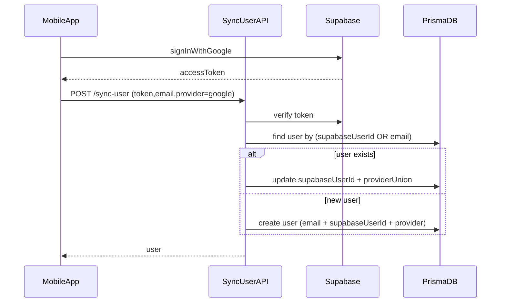

# Sync user by email + provider merge

## Goal

- **One email = one `UserAccount`** (already enforced by `UserAccount.email @unique` in [`prisma/schema.prisma`](/root/Project/final-project-backend/prisma/schema.prisma)).
- When a user logs in with Google using the same email as an existing email/password user, **update the same DB row** and set provider to **`email,google`**.

## Key change (logic)

- Update [`server/auth/auth.service.ts`](/root/Project/final-project-backend/server/auth/auth.service.ts):
  - Accept input provider values: `email`, `google`, (keep `both` for old clients), and `email,google`.
  - **Store** provider only as: `email` | `google` | `email,google` (always this order).
  - Replace the current merge behavior (`both` + `allowMerge`) with **auto merge**:
    - If DB has `email` and login is `google` ⇒ save `email,google`.
    - If DB provider is null but `password` exists ⇒ treat as `email`.
    - Keep updating `supabaseUserId` to the current token user id (same as now).

## API route updates

- Update provider validation + docs text in:
  - [`app/api/mobile/v1/auth/sync-user/route.ts`](/root/Project/final-project-backend/app/api/mobile/v1/auth/sync-user/route.ts)
  - [`app/api/admin/v1/sync-admin/route.ts`](/root/Project/final-project-backend/app/api/admin/v1/sync-admin/route.ts)
- Keep `allowMerge` in request body for backward compatibility, but **it will no longer block** merging.

## Docs + OpenAPI

- Update enums and examples to use **`email,google`** (and note we still accept old `both` input):
  - [`public/openapi.json`](/root/Project/final-project-backend/public/openapi.json)
  - [`docs/AUTHENTICATION.md`](/root/Project/final-project-backend/docs/AUTHENTICATION.md)
  - Any other docs that mention `both`.

## Optional one-time data cleanup

- (Optional) Convert old DB values `PROVIDER='both'` to `PROVIDER='email,google'` with a small script or SQL.

## Files likely touched

- [`server/auth/auth.service.ts`](/root/Project/final-project-backend/server/auth/auth.service.ts)
- [`app/api/mobile/v1/auth/sync-user/route.ts`](/root/Project/final-project-backend/app/api/mobile/v1/auth/sync-user/route.ts)
- [`app/api/admin/v1/sync-admin/route.ts`](/root/Project/final-project-backend/app/api/admin/v1/sync-admin/route.ts)
- [`public/openapi.json`](/root/Project/final-project-backend/public/openapi.json)
- [`docs/AUTHENTICATION.md`](/root/Project/final-project-backend/docs/AUTHENTICATION.md)

