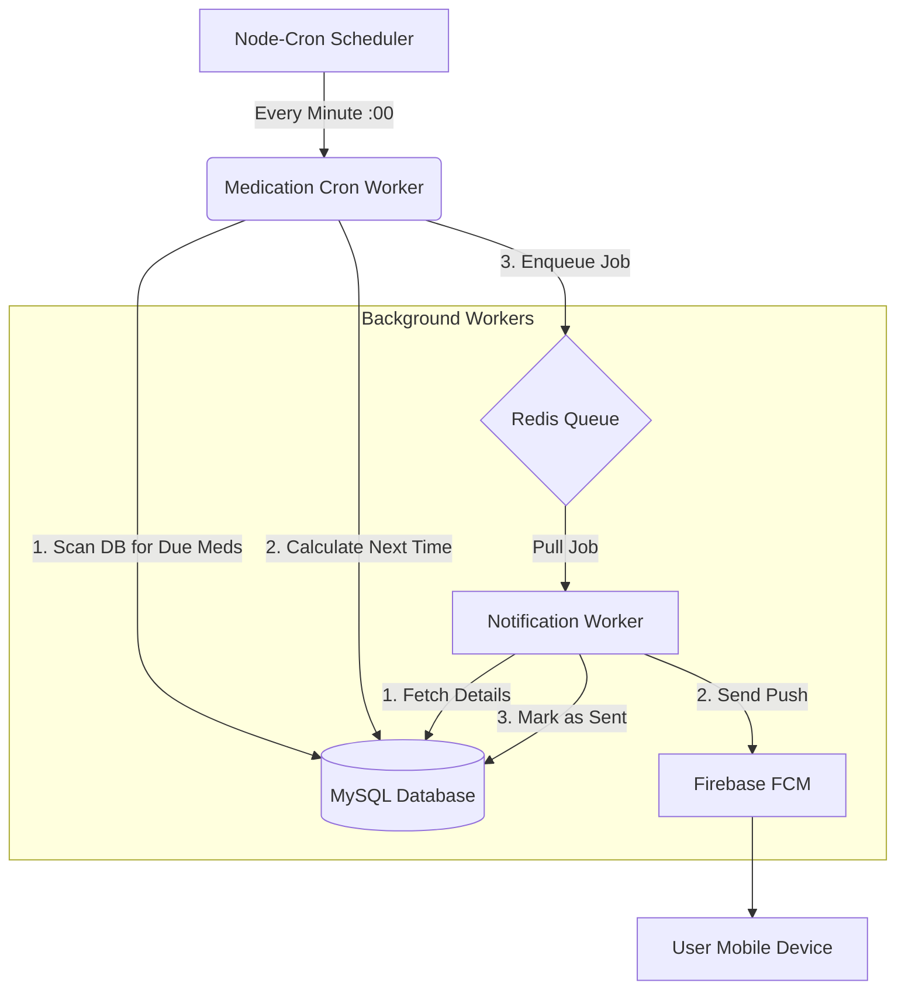

# Medication Notification System & Queue Architecture

This document details the high-reliability notification system designed to reduce data loss, ensure precision timing, and scale efficiently. The core architecture uses **Node-Cron** for scheduling and **Redis + BullMQ** for reliable background processing.

## 1. The Core Problem & Solution

### Previous Issues (Direct Send approach)
- **Timing Jitter:** Using `setInterval` meant the execution drifted based on when the server started. If logs showed restarts at `:35` seconds, every notification was delayed by 35s.
- **Data Loss Risk:** If the server crashed *after* updating the database (to mark "next occurrence") but *before* sending to FCM, the user would miss their medication.
- **Blocking Operations:** Sending 1,000 FCM requests in a loop would block the cron job, delaying subsequent users.

### The Solution: Queue-Based Architecture
We decoupled **"Scheduling"** (The Brain) from **"Sending"** (The Muscle).
1.  **Strict Scheduling:** `node-cron` ensures the check runs exactly at `XX:XX:00`.
2.  **Reliability:** Jobs are saved to Redis (persisted to disk). Even if the entire server crashes, pending jobs survive and are processed on restart.
3.  **Concurrency:** Workers process jobs in parallel without blocking the scheduler.

---

## 2. High-Level Data Flow



---

## 3. Detailed Logic Flow

### Phase 1: The Producer (Scheduler)
**File:** `server/workers/medicationCron.worker.ts`

1.  **Trigger:** `cron.schedule("* * * * *")` fires exactly at the start of every minute.
2.  **Query:** Finds all `UserMedicineRegimen` where `nextOccurrenceAt <= NOW`.
3.  **Parallel Processing (The Loop):**
    - **Step 3a:** Creates a `MedicationLog` entry (Status: `PENDING`, `pushSentAt: null`).
    - **Step 3b:** Updates `UserMedicineRegimen` to the *next* future occurrence (e.g., moves from 8:00 AM to 8:00 PM). This prevents double-sending.
    - **Step 3c:** Adds a job to **Redis Queue** (`medication-notification`).
        - Payload: `{ "logId": 123 }`
4.  **Completion:** The cron job finishes in milliseconds. It does *not* wait for FCM.

### Phase 2: The Queue (Redis)
**Infrastructure:** Docker Container `final_project_redis`
- Acts as a persistent buffer.
- Stores jobs with metadata (attempts, timestamps).
- Enabled AOF (Append Only File) to save data to disk, preventing loss on crash.

### Phase 3: The Consumer (Worker)
**File:** `server/workers/notificationConsumer.ts`

1.  **Trigger:** BullMQ Worker listening on `medication-notification` queue picks up `{ logId: 123 }`.
2.  **Validation:**
    - Checks if `MedicationLog` exists.
    - **Idempotency Check:** Checks `if (log.pushSentAt)` to ensure we don't spam the user if a job was accidentally duplicated.
3.  **Data Fetching:**
    - Loads User Profile, Medicine Name, and Device Tokens.
4.  **Execution (FCM):**
    - Constructs the payload (Title, Body, Data).
    - Calls `sendFcmMulticast`.
5.  **Cleanup & Confirmation:**
    - **Success:** Updates `MedicationLog` with `pushSentAt = NOW`.
    - **Invalid Tokens:** Automatically removes invalid device tokens (e.g., app uninstalled) from the DB.
    - **Failure:** If FCM completely fails (network error), the Worker throws an error. BullMQ automatically retries the job (Configured for 3 attempts with exponential backoff).

---

## 4. Key Files & Components

| File Path | Purpose |
| :--- | :--- |
| `server/workers/medicationCron.worker.ts` | **The Scheduler.** Runs every minute. Scans DB and updates schedules. **Producers** jobs. |
| `server/workers/snoozeCron.worker.ts` | **The Snooze Scheduler.** Scans for snoozed logs. **Producers** jobs with `isSnooze: true`. |
| `server/workers/notificationConsumer.ts` | **The Logic.** Contains the function `processNotificationJob` that actually talks to FCM. |
| `server/workers/queueWorker.ts` | **The Entry Point.** Initialize the Worker process that listens to the queue. |
| `server/queue/client.ts` | **Configuration.** Shared Redis connection settings and Queue definitions. |
| `deployment/docker-compose.yml` | **Infrastructure.** Adds the Redis container. |
| `deployment/ecosystem.config.cjs` | **Process Manager.** Defines `queue-worker` as a separate persistent process. |

## 5. Why this is "Production Grade"

1.  **Precision:** We moved from relative intervals (drift) to absolute cron scheduling.
2.  **Resilience:**
    - **Database Transaction:** The "Next Occurrence" update happens *before* the notification is attempted.
    - **Retry Mechanism:** Temporary network glitches don't cause missed meds.
3.  **Scalability:**
    - We can run multiple `queue-worker` instances if we have millions of users.
    - The Cron logic stays lightweight and won't timeout.

## 6. How to Verify

Check the logs for the complete lifecycle:

**1. Cron Log (`logs/medication-cron-out.log`):**
```text
[medication-cron] Processing 5 regimens -> Queue
[medication-cron] Enqueued 5 jobs.
```

**2. Worker Log (`logs/queue-worker-out.log`):**
```text
[NotificationWorker] Processing job 101 for log 550
[NotificationWorker] Success for log 550
[NotificationQueue] Job 101 has completed!
```
